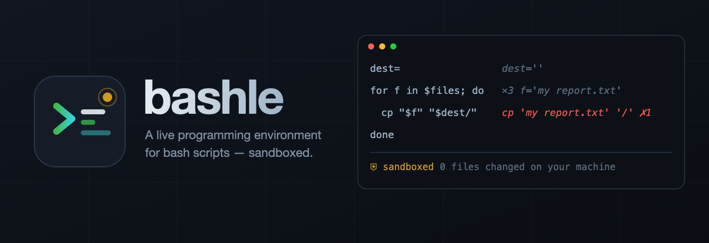

<p align="center">
  
</p>

<p align="center">
  <em>Stop reading diffs and running tests to find out what your shell script does.<br>
  Watch it run, line by line, expansion by expansion — without letting it touch your machine.</em>
</p>

---

## The problem

A bash script's bugs are almost never logic bugs. They're **expansion bugs**: an empty variable, an
unquoted word that split into three, a glob that matched nothing. `shellcheck` catches some of them
statically. A test tells you *that* something failed. Neither shows you the thing you actually need:

```bash
cp "$f" "$dest/$(date +%F)/"
```

What did bash *run*? With bashle, the answer is on the line, the moment you save:

```bash
dest=                              dest=''
for f in $files; do                ×3  f='my report.txt'
  cp "$f" "$dest/"                 cp 'my report.txt' '/'  ✗1
done
```

`$dest` was empty, and you can see it in the command that ran. No test run, no guessing.

## Requirements

| | |
|---|---|
| **bash ≥ 4.1** | For `BASH_XTRACEFD`. macOS ships bash **3.2**, which will not work — `brew install bash` and bashle finds it automatically. |
| **macOS** | Containment uses `sandbox-exec` and APFS clones. Linux support is not built yet. |
| **VS Code ≥ 1.85** | |

## Quick start

1. Open a `.sh` file.
2. Add a probe comment saying how to run it.
3. Save.

```bash
# @probe staging --dry-run
set -euo pipefail

target="$1"
mkdir -p "releases/$target"
echo "deploying to $target" > "releases/$target/log.txt"
```

On save you get expansions and exit codes inline, and a **Files** panel showing that the run created
`releases/staging/` and `releases/staging/log.txt` — in a throwaway clone, not in your repo.

## Probes

A probe is a comment. One rule: `# @probe <shell words>`, interpreted against whatever it is attached to.

```bash
# @probe staging --dry-run          ← attached to the file: the script's "$@"
# @probe prod => exit 1             ← with an expected exit code

# @probe "a//b" => "a/b"            ← attached to a function: the function's args
normalize_path() {
  echo "${1//\/\//\/}"
}
```

**Modifiers** apply to every probe in the same comment block:

```bash
# @env DEPLOY_ENV=staging
# @stdin "yes"
# @probe --interactive
```

**Expectations** are optional. `=> exit N` checks the exit code; `=> "text"` checks stdout with the
trailing newline ignored. Without one you just get the observed values, no verdict.

Several probes can share a target — each runs in its own clean clone:

```bash
# @probe 2 3 => "5"
# @probe -1 1 => "0"
add() { echo $(( $1 + $2 )); }
```

> **Function probes source your script.** If it has no `[[ "${BASH_SOURCE[0]}" == "$0" ]]` guard
> around its main body, that body runs first. Bashle detects this and says so rather than letting you
> wonder where the extra output came from.

## What you get

**Inline** — the expanded command, an `✗N` badge on a nonzero exit, `×N` when a line ran more than
once, and the values of variables that line mentions.

**On hover** — every execution of that line, numbered, with its own expansion, exit code and variables.

**In the panel** — three tabs:

- **Files** *(default)* — what the run created, modified and deleted, with diffs. For a file-manipulation
  script this is the real output.
- **Trace** — every executed line in order: line number, iteration, the command as bash ran it, exit code, variables.
- **Output** — the script's own stdout and stderr, kept separate from the trace.

## Containment

Probe runs execute real commands. Bashle contains them in three layers, and tells you which ones are active.

1. **Scratch clone.** Your workspace is cloned with `cp -c` (APFS clonefile — instant, and consumes
   no disk until something writes), and the script runs with its cwd there. Relative paths hit the
   clone, and they hit files that genuinely exist, so the script behaves realistically.
2. **Redirected environment.** `HOME` and `TMPDIR` point inside the clone, so `~/.config/...` and
   `mktemp` are contained too.
3. **Kernel enforcement.** A `sandbox-exec` profile denies all writes outside the clone, denies the
   network outright, and denies executing `sudo`. A blocked write fails visibly instead of silently
   succeeding.

Afterwards the clone is diffed against your pristine workspace to produce the Files tab, then deleted.

**What this does not protect you from.** A command that does its work in another process — `docker`,
`launchctl`, anything talking to a system daemon — is not stopped by a file sandbox. Treat probes on
scripts like those with the same care you'd treat running them.

The status bar shows `⛨` when kernel enforcement is on and `⚠` when only layers 1–2 are, so you are
never guessing about which you have.

## Supported today

Bashle is being built out iteratively, starting with the constructs that carry most scripts:

**Working now** — assignments, simple commands, `for` / `while` / `until`, `if` / `case`,
functions, variable expansion and word splitting, redirections, exit codes, file manipulation.

**Not yet** — per-stage attribution inside pipelines (a pipeline is reported as one line), values
inside subshells and process substitution, `trap` handlers you install yourself (bashle's own
`DEBUG` and `EXIT` traps will be replaced by them), and scripts that re-enter bash as a child process.

The trace model already records subshell level and nesting depth, so widening coverage is additive.

## Settings

| Setting | Default | |
|---|---|---|
| `bashle.bashPath` | *(auto)* | Path to a bash ≥ 4.1. Auto-discovers Homebrew, then `PATH`. |
| `bashle.runOnSave` | `true` | Run probes on save. Turn off to drive it with `⌘⌥R` only. |
| `bashle.timeoutMs` | `5000` | Kill a probe run after this long. The partial trace is kept. |
| `bashle.enforceSandbox` | `true` | Kernel enforcement. Turning it off leaves only the clone containing the run. |
| `bashle.maxRecords` | `50000` | Stop tracing after this many events and mark the trace truncated. |
| `bashle.maxCloneBytes` | `512 MB` | Refuse to clone a workspace larger than this. |
| `bashle.watchAllVariables` | `false` | Snapshot every variable instead of only those the script names. Slower. |

## Commands

| | |
|---|---|
| `⌘⌥R` | Run probes in this file |
| `⌘⌥I` | Inspect this line (opens the Trace tab) |
| — | Bashle: Show panel · Bashle: Clear annotations |

## How it works

No source rewriting — your file is never modified. The tracer is injected through `BASH_ENV`, which
bash sources before a non-interactive script:

- `PS4` is set to emit a structured record with `BASH_SOURCE`, `LINENO` and `BASH_SUBSHELL`, and
  `set -x` writes it to **file descriptor 9** via `BASH_XTRACEFD` — so the trace never collides with
  your script's own stdout or stderr.
- A `DEBUG` trap with `set -T` records the unexpanded command, the previous command's exit status,
  and a `declare -p` snapshot of the variables your script actually names.
- Records are `\x1f`-delimited fields in `\x1e`-delimited records, which bash emits with a single
  `printf` and no quoting hazards.

Pairing those two streams is less obvious than it sounds — `for` loops emit their xtrace line
*before* the `DEBUG` trap fires, so the parser matches in either order and attributes each exit code
to the command that actually preceded it.

## Running it locally

```bash
npm install
```

### In the terminal, without VS Code

The fastest loop. `npm run probe` runs every probe in a file through the real engine — same tracer,
same sandbox — and prints the annotations inline.

```bash
npm run probe -- examples/deploy.sh
```

```
 15   mkdir -p "$dest"                    mkdir -p releases/staging  dest=releases/staging
 17   for artifact in app.js styles.css readme md; do   ×4  ✗1  artifact=readme
 18     cp "artifacts/$artifact" "$dest/"  ×4  cp artifacts/md releases/staging/  ✗1  artifact=md

 files changed in the sandbox
   + releases/staging/app.js
   + releases/staging/status.txt
   + releases/staging/styles.css
 exit 0 · ⛨ sandboxed
```

`examples/deploy.sh` has a deliberate bug: `readme md` is unquoted, so it splits into two words and
the loop runs **four** times instead of three. You can see it in the iteration count, in the failing
`cp artifacts/md`, and in the Files list where `readme md` was never copied — and your real
`examples/` directory is untouched.

### In VS Code

1. Open this folder in VS Code.
2. Press **F5** (*Run Bashle in a new VS Code window*). It builds first, then opens a second window
   with the extension loaded and `examples/` as its workspace.
3. Open `examples/deploy.sh` in that window and hit **⌘S**.

Annotations appear at end of line, hover a line for every execution of it, and `⌘⌥I` opens the panel.
Edit and save again to watch it update. Extension logs go to the *Debug Console* of the first window;
reload the second window with **⌘R** after changing extension code.

### Tests

```bash
npm test          # 128 tests, including end-to-end runs against real bash and a real sandbox
npm run build     # bundle to dist/extension.js
npm run typecheck
```

The containment tests are adversarial on purpose: scripts that try to write to `/tmp`, to an absolute
path back inside the real workspace, and to delete real files must each be blocked *and* reported.

## License

MIT
