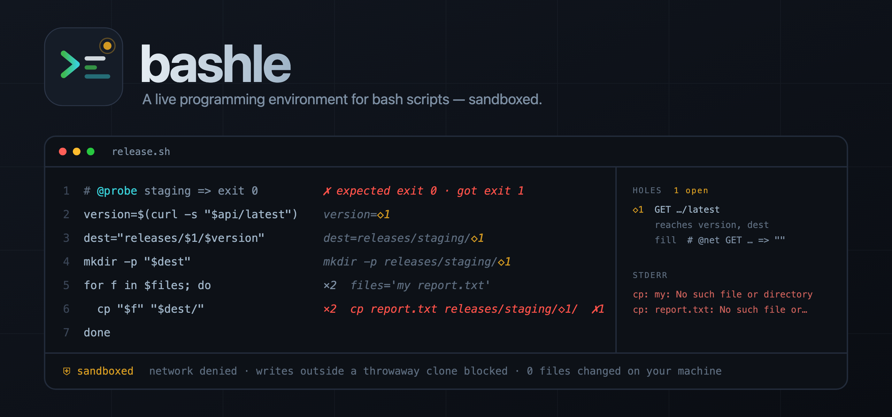

<p align="center">
  
</p>

<p align="center">
  <em>See what your bash script actually runs, line by line, every time you save,<br>
  without letting it touch your machine.</em>
</p>

<p align="center">
  <a href="https://github.com/srj31/bashle/actions/workflows/ci.yml"></a>
  <a href="https://github.com/srj31/bashle/actions/workflows/ci.yml"></a>
  <a href="https://open-vsx.org/extension/srj31/bashle"></a>
</p>

---

## The problem

Bash doesn't run the text you wrote. It first fills in the variables, splits words at spaces and
expands wildcards, and then runs the result. Most shell bugs live in the gap between the two, and
reading the script won't show you that gap.

This script has two such bugs:

```bash
file=$1
backup_dir=backup

rm -rf "$backupdir/partial"
mkdir -p "$backup_dir"
cp $file "$backup_dir/"
echo "backed up $file"
```

The usual ways to find them are all bad:

- **Run it and see.** That runs it against your real files, and this one deletes things.
- **Add `echo`s or `set -x`.** Then you're digging through a wall of output, away from the code.
- **Write a test.** A test checks the exit code. This script exits 0, so the test passes.

## What bashle shows you

Add one comment saying how to run the script, then save. Bashle runs it in a throwaway sandbox and
writes, at the end of each line, what bash actually ran:

```bash
# @probe "reports/Q3 report.txt" => exit 0   ✓ passed in 44 ms
file=$1                        file='reports/Q3 report.txt'
backup_dir=backup              backup_dir=backup

rm -rf "$backupdir/partial"    rm -rf /partial
mkdir -p "$backup_dir"         mkdir -p backup  backup_dir=backup
cp $file "$backup_dir/"        cp reports/Q3 report.txt backup/  ✗1  file='reports/Q3 report.txt'  backup_dir=backup
echo "backed up $file"         echo 'backed up reports/Q3 report.txt'  file='reports/Q3 report.txt'
```

Both bugs are now on the screen:

- `$backupdir` is a typo for `$backup_dir`, so it was empty, and the `rm` pointed at **`/partial`**,
  at the root of your disk.
- `$file` isn't quoted, so bash split the filename at the space. `cp` got `reports/Q3` and
  `report.txt`, and failed (`✗1`).

The probe still **passed**. The script exited 0, as the probe asked, and it's broken anyway:
checking the result missed both bugs, and seeing the commands caught them. None of it touched your
machine. The run happened in a disposable copy of your project, with the network off and writes
outside the copy blocked by the operating system.

This is [`examples/backup.sh`](examples/backup.sh). Try it yourself.

## What you get

- **Every line as bash ran it:** the command with its variables filled in, its exit code, how many
  times it ran, and the values it used. Hover a line to see each run.
- **Every file the script touched:** created, changed or deleted, with the changes shown. All of it
  in the copy, none in your project.
- **No real network calls.** `curl`, `ssh`, `docker` and similar commands don't run. Each answer
  becomes a placeholder (`◇1`) that you can follow through the script, or fill in with a value you
  choose.
- **Checks when you want them.** Add `=> exit 0` or `=> "expected output"` to a probe to make it a
  test.
- **Your editor:** VS Code, Cursor, VSCodium, Vim 9, or the terminal.

## Install

You need macOS or Linux, and **bash 4.1 or newer**. macOS ships 3.2, so run `brew install bash` and
bashle will find it. On Linux, install `bubblewrap` (`apt install bubblewrap`) for the sandbox.

- **Cursor, VSCodium** and other editors that use [Open VSX](https://open-vsx.org/extension/srj31/bashle):
  search for *Bashle* in the Extensions view.
- **VS Code** 1.85 or newer: install the `.vsix` from Open VSX, or build it:

  ```bash
  git clone https://github.com/srj31/bashle && cd bashle
  npm install && npm run package
  code --install-extension bashle-*.vsix
  ```

- **Vim** or **the terminal**: see [Set up](docs/guide.md#set-up) in the guide.

## Start here

1. Open a `.sh` file.
2. Add a comment with `# @probe` followed by the arguments you'd pass the script.
3. Save.

**New to bashle? Read [the guide](docs/guide.md).** In about ten minutes, and in plain language, it
covers writing probes, reading the results, handling network calls, and what the sandbox does and
doesn't protect you from.

## Documentation

- **[The bashle guide](docs/guide.md)**: start here
- [Using bashle in a real repository](docs/using-in-a-repository.md): `.bashleignore`, large
  repositories, per-project settings
- [How it works](docs/internals.md): how bashle records a run, and which bash features it covers
- [A semantics for holes](docs/semantics.md) and [its Lean 4 formalization](proofs/README.md): what
  a placeholder means, stated precisely
- [Contributing](CONTRIBUTING.md): running it locally, and the test suite

## License

MIT
